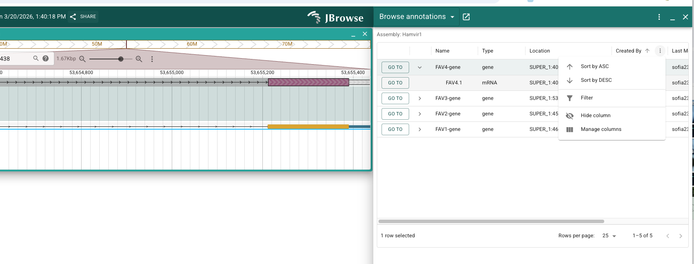

# jbrowse-plugin-apollo-annotation-browser

A JBrowse 2 plugin that adds an **Annotation Browser** drawer widget to [Apollo](https://github.com/GMOD/Apollo3). It shows all user-submitted annotations across an assembly in a searchable, sortable table — including who created and last modified each annotation, when, and where on the genome.



## Features

- **Browse all annotations** for any Apollo assembly in a compact drawer table
- **Expandable gene rows**: click the chevron to expand a gene and see its mRNA children
- **Edit names inline**: double-click any Name cell to set or update the `Name` attribute directly in the table — saves to Apollo immediately
- **See who annotated what**: creator, last modifier, and last modified timestamp
- **Navigate to any annotation** with a single "Go to" click — jumps the linear genome view to that feature
- **Quick filter / search** via the built-in toolbar search box
- **Assembly picker**: if no assembly is open in the viewer, prompts you to select one from a dropdown
- **Toggleable columns**: Created column is hidden by default but can be turned on via the column menu
- Works with Apollo's authentication — no extra credentials needed

## Usage

1. Open JBrowse with an Apollo instance loaded
2. Click the **Apollo** menu → **Browse Annotations**
   - If an assembly is already open in the viewer, it loads annotations for that assembly immediately
   - If no assembly is open, a dialog appears to select one
3. The annotation table opens in the right-hand drawer
4. Click **▶** on a gene row to expand and see its mRNA transcripts
5. Click **Go to** on any row to navigate the genome view to that feature
6. **Double-click** a Name cell to edit the feature's `Name` attribute — press Enter to save

## Table Columns

| Column | Default | Notes |
|--------|---------|-------|
| Go to | ✅ | Navigates the genome view to the feature |
| ▶/▼ | ✅ | Expand/collapse gene to show mRNA children |
| Name | ✅ | Feature `Name` attribute — double-click to edit; blank if not yet set |
| Type | ✅ | Feature type (gene, mRNA, etc.) |
| Location | ✅ | `refSeq:start–end` |
| Created By | ✅ | User who first created the annotation |
| Last Modified By | ✅ | User who most recently edited it |
| Last Modified | ✅ | Timestamp of most recent edit |
| Created | hidden | Creation timestamp — toggle on via column menu |

## Notes on Name vs ID

The `Name` attribute is for human-readable labels and can be freely edited. The `ID` attribute is the stable unique identifier used internally by Apollo and is never modified by this plugin.

## Deployment

Build the plugin and copy the built JS to your JBrowse web directory, then register it in `config.json`:

```bash
npm install
npm run build
# copy dist/jbrowse-plugin-apollo-annotation-browser.umd.development.js to your web directory
```

```json
{
  "plugins": [
    {
      "name": "ApolloAnnotationBrowser",
      "umdLoc": {
        "uri": "jbrowse-plugin-apollo-annotation-browser.umd.development.js"
      }
    }
  ]
}
```

## Development

Requires Node.js ≥ 18.

```bash
npm install       # install deps
npm run build     # production build → dist/
npm start         # dev server with watch
```

## How It Works

The plugin uses Apollo's `/changes` API endpoint to find all `AddFeatureChange` and `AddFeaturesFromFileChange` events for the selected assembly. It resolves full feature details (name, type, location, child features) via `/features/getByIds`, then builds a table showing the creator (first change per feature) and last modifier (most recent change). Deleted features are automatically excluded.

Inline name editing submits a `FeatureAttributeChange` to Apollo's `/changes` endpoint, updating only the `Name` attribute without touching the stable `ID`.

## License

MIT
